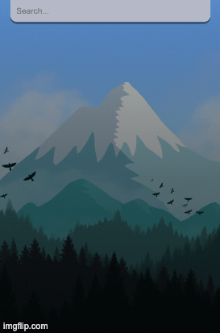

# Getting Started with Create React App

This project was bootstrapped with [Create React App](https://github.com/facebook/create-react-app).

Weather app in React JS, i used the Open Weather Map API to make calls to a restful api to return the current weather data. This uses the Modern Javascript Fetch AP along with React hooks and conditonals.

